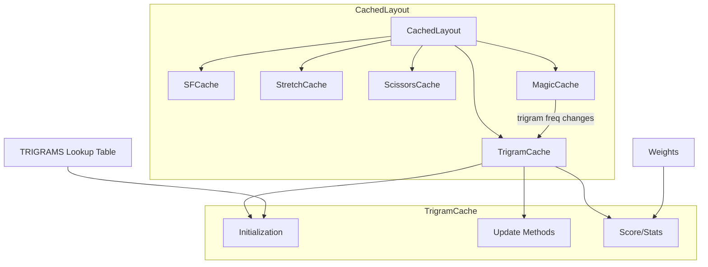

# Design Document: Trigrams Analyzer

## Overview

The Trigrams Analyzer feature adds a `TrigramCache` to the oxeylyzer keyboard layout analyzer. This cache tracks trigram type frequencies (alternate, inroll, outroll, redirect, onehandin, onehandout) and provides incremental scoring updates during layout optimization.

The design follows the established cache pattern used by `SFCache`, `StretchCache`, and `ScissorsCache`:
- Pre-compute position combinations during initialization
- Maintain running frequency totals for each trigram type
- Support incremental updates via `update_trigram`, `replace_key`, and `key_swap`
- Integrate with `CachedLayout` for unified scoring

## Architecture



The `TrigramCache` integrates with `CachedLayout` alongside existing caches. It receives trigram frequency updates from `MagicCache` when magic rules redistribute frequencies, and uses the existing `TRIGRAMS` constant for type classification.

## Components and Interfaces

### TrigramCache

The main cache structure for tracking trigram frequencies and computing scores.

```rust
/// Pre-computed trigram combination with type
#[derive(Debug, Clone, Copy, PartialEq)]
pub struct TrigramCombo {
    /// Second position in the trigram
    pub pos_b: usize,
    /// Third position in the trigram
    pub pos_c: usize,
    /// Pre-computed trigram type
    pub trigram_type: TrigramType,
}

/// Delta representing changes to TrigramCache state
#[derive(Default)]
struct TrigramDelta {
    inroll_freq: i64,
    outroll_freq: i64,
    alternate_freq: i64,
    redirect_freq: i64,
    onehandin_freq: i64,
    onehandout_freq: i64,
}

#[derive(Debug, Clone, Default, PartialEq)]
pub struct TrigramCache {
    /// For each position, list of (pos_b, pos_c, type) combinations
    trigram_combos_per_key: Vec<Vec<TrigramCombo>>,

    /// Number of keys for frequency array indexing
    num_keys: usize,

    /// Running frequency totals for each trigram type
    inroll_freq: i64,
    outroll_freq: i64,
    alternate_freq: i64,
    redirect_freq: i64,
    onehandin_freq: i64,
    onehandout_freq: i64,

    /// Pre-computed weights from configuration
    inroll_weight: i64,
    outroll_weight: i64,
    alternate_weight: i64,
    redirect_weight: i64,
    onehandin_weight: i64,
    onehandout_weight: i64,

    /// Finger assignments for trigram type lookup
    fingers: Vec<usize>,
}
```

### Public Interface

```rust
impl TrigramCache {
    /// Create a new cache from keyboard layout and finger assignments
    pub fn new(fingers: &[Finger], num_keys: usize) -> Self;

    /// Set weights from configuration
    pub fn set_weights(&mut self, weights: &Weights);

    /// Update for a trigram frequency change
    pub fn update_trigram(
        &mut self,
        p_a: usize,
        p_b: usize,
        p_c: usize,
        old_freq: i64,
        new_freq: i64,
    );

    /// Replace key at position. Returns the new score.
    /// If `apply` is false, computes the score without mutating state.
    pub fn replace_key(
        &mut self,
        pos: usize,
        old_key: usize,
        new_key: usize,
        keys: &[usize],
        skip_pos: Option<usize>,
        tg_freq: &[Vec<Vec<i64>>],
        apply: bool,
    ) -> i64;

    /// Swap keys at two positions. Returns the new score.
    /// If `apply` is false, computes the score without mutating state.
    pub fn key_swap(
        &mut self,
        pos_a: usize,
        pos_b: usize,
        key_a: usize,
        key_b: usize,
        keys: &[usize],
        tg_freq: &[Vec<Vec<i64>>],
        apply: bool,
    ) -> i64;

    /// Get the current weighted score
    pub fn score(&self) -> i64;

    /// Populate statistics with normalized trigram frequencies
    pub fn stats(&self, stats: &mut Stats, trigram_total: f64);
}
```

### CachedLayout Integration

The `CachedLayout` struct will be extended to include the `TrigramCache`:

```rust
pub struct CachedLayout {
    // ... existing fields ...
    trigram: TrigramCache,
}

impl CachedLayout {
    pub fn score(&self) -> i64 {
        self.sfb.score()
            + self.stretch.score()
            + self.scissors.score()
            + self.trigram.score()
    }

    pub fn stats(&self, stats: &mut Stats) {
        // ... existing stats ...
        self.trigram.stats(stats, self.data.trigram_total);
    }
}
```

## Data Models

### TrigramCombo

Stores a pre-computed trigram combination for efficient lookup:

| Field | Type | Description |
|-------|------|-------------|
| pos_b | usize | Second position in the trigram |
| pos_c | usize | Third position in the trigram |
| trigram_type | TrigramType | Pre-computed type from TRIGRAMS lookup |

### TrigramDelta

Tracks changes to frequency totals during key operations:

| Field | Type | Description |
|-------|------|-------------|
| inroll_freq | i64 | Change to inroll frequency |
| outroll_freq | i64 | Change to outroll frequency |
| alternate_freq | i64 | Change to alternate frequency |
| redirect_freq | i64 | Change to redirect frequency |
| onehandin_freq | i64 | Change to onehandin frequency |
| onehandout_freq | i64 | Change to onehandout frequency |

### Trigram Type Classification

The existing `TRIGRAMS` constant provides O(1) lookup for trigram types:

```rust
// From trigrams.rs - reused, not reimplemented
pub const TRIGRAMS: [TrigramType; 1000] = trigrams();

// Lookup: TRIGRAMS[f1 * 100 + f2 * 10 + f3]
// where f1, f2, f3 are finger indices (0-9)
```

### Tracked vs Untracked Types

| Type | Tracked | Reason |
|------|---------|--------|
| Inroll | Yes | Positive scoring metric |
| Outroll | Yes | Positive scoring metric |
| Alternate | Yes | Positive scoring metric |
| Redirect | Yes | Negative scoring metric |
| OnehandIn | Yes | Scoring metric |
| OnehandOut | Yes | Scoring metric |
| Sft | No | Handled by SFCache |
| Sfb | No | Handled by SFCache |
| Thumb | No | Ignored in scoring |
| Invalid | No | Invalid combinations |


## Correctness Properties

*A property is a characteristic or behavior that should hold true across all valid executions of a system—essentially, a formal statement about what the system should do. Properties serve as the bridge between human-readable specifications and machine-verifiable correctness guarantees.*

### Property 1: Tracked Type Frequency Updates

*For any* trigram with a tracked type (Inroll, Outroll, Alternate, Redirect, OnehandIn, OnehandOut) and *for any* frequency delta, calling `update_trigram` should increase the corresponding type's frequency total by exactly that delta.

**Validates: Requirements 1.2, 4.1, 4.2**

### Property 2: Untracked Types Ignored

*For any* trigram with an untracked type (Sft, Sfb, Thumb, Invalid) and *for any* frequency delta, calling `update_trigram` should leave all frequency totals unchanged.

**Validates: Requirements 1.3, 4.3**

### Property 3: Weight Application

*For any* TrigramCache with non-zero frequencies and *for any* set of weights, after calling `set_weights`, the `score()` should equal the sum of (frequency × weight) for each tracked type.

**Validates: Requirements 3.1, 6.2**

### Property 4: Incremental Score Consistency

*For any* layout state and *for any* key replacement or swap operation, the score returned by the incremental operation should equal the score computed by a full recalculation from scratch.

**Validates: Requirements 5.1, 5.4**

### Property 5: Apply True Mutates State

*For any* key operation with `apply=true`, the cache's internal frequency totals should reflect the change, and subsequent calls to `score()` should return the same value as was returned by the operation.

**Validates: Requirements 5.2**

### Property 6: Apply False Preserves State

*For any* key operation with `apply=false`, the cache's internal state should remain unchanged, and `score()` called before and after should return the same value.

**Validates: Requirements 5.3**

### Property 7: Score Equals Weighted Sum

*For any* TrigramCache state, `score()` should equal: `inroll_freq * inroll_weight + outroll_freq * outroll_weight + alternate_freq * alternate_weight + redirect_freq * redirect_weight + onehandin_freq * onehandin_weight + onehandout_freq * onehandout_weight`.

**Validates: Requirements 6.1, 6.2**

### Property 8: Stats Normalization

*For any* TrigramCache with non-zero frequencies and *for any* positive trigram_total, calling `stats()` should populate each TrigramStats field with the corresponding frequency divided by trigram_total.

**Validates: Requirements 7.1**

### Property 9: CachedLayout Integration

*For any* CachedLayout and *for any* sequence of key operations (replace_key, swap_keys, apply_magic_rule), the trigram component of the total score should be updated correctly, and stats should reflect the current trigram frequencies.

**Validates: Requirements 8.3, 8.4, 8.5, 8.6, 8.7**

## Error Handling

### Invalid Position Handling

- If a position index is out of bounds, the cache should handle it gracefully without panicking
- Invalid key indices (>= num_keys) should be treated as empty/invalid and contribute zero frequency

### Division by Zero in Stats

- If trigram_total is zero or negative, stats should return zero for all fields rather than panicking or returning NaN

### Empty Cache Operations

- Operations on an empty cache (no trigram combinations) should return zero score and not panic

## Testing Strategy

### Unit Tests

Unit tests should cover:
- Cache initialization with various keyboard sizes
- Weight setting and retrieval
- Individual trigram type classification
- Edge cases: empty positions, invalid keys, zero frequencies

### Property-Based Tests

Property-based tests should be implemented using a Rust PBT library (e.g., `proptest` or `quickcheck`).

Each property test must:
- Run minimum 100 iterations
- Reference the design document property in a comment tag
- Generate random but valid inputs (finger assignments, frequencies, key positions)

**Test Configuration:**
```rust
// Example proptest configuration
proptest! {
    #![proptest_config(ProptestConfig::with_cases(100))]

    // Feature: trigrams-analyzer, Property 1: Tracked Type Frequency Updates
    #[test]
    fn prop_tracked_type_updates(/* generators */) {
        // ...
    }
}
```

### Integration Tests

Integration tests should verify:
- TrigramCache works correctly within CachedLayout
- Magic rule application updates trigram frequencies
- Score and stats are consistent across all caches

### Test Data Generation

For property tests, generate:
- Random finger assignments (10 fingers, valid indices 0-9)
- Random key positions (valid indices within num_keys)
- Random frequencies (non-negative i64 values)
- Random weights (i64 values, can be positive or negative)
